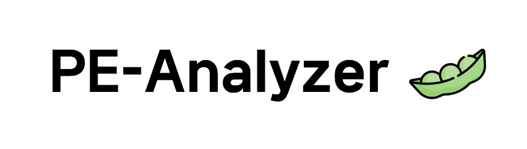

# PE-A(Analyzer)
--------------------

   
<!---->

## 개요
 프로젝트 `PEA`는 'PE(Portable Executable)' 파일 포맷을 분석하고 디지털 포렌식 분야에서 활용하며 실무에서도 충분히 사용될 수 있는 도구를 개발하는 것을 목표로 진행된 프로젝트이다. 기능별로 파편화된 도구들을 통합해서 초보자도 손쉽게 사용할 수 있도록 설계했다.
   
### 주요 기능
   
- PE 파일 분석
- 패킹 여부 검사
- 헥스 에디터
- 분석 리포트
   
### 개발 환경 및 사용 프로그램
   
- pyCharm(Python)
- Qt Designer

## 프로젝트 참여 멤버
 - 유영찬
 - 강필성
 - 김태현
 - 신동규
 - 이용위
 - 유승현
    